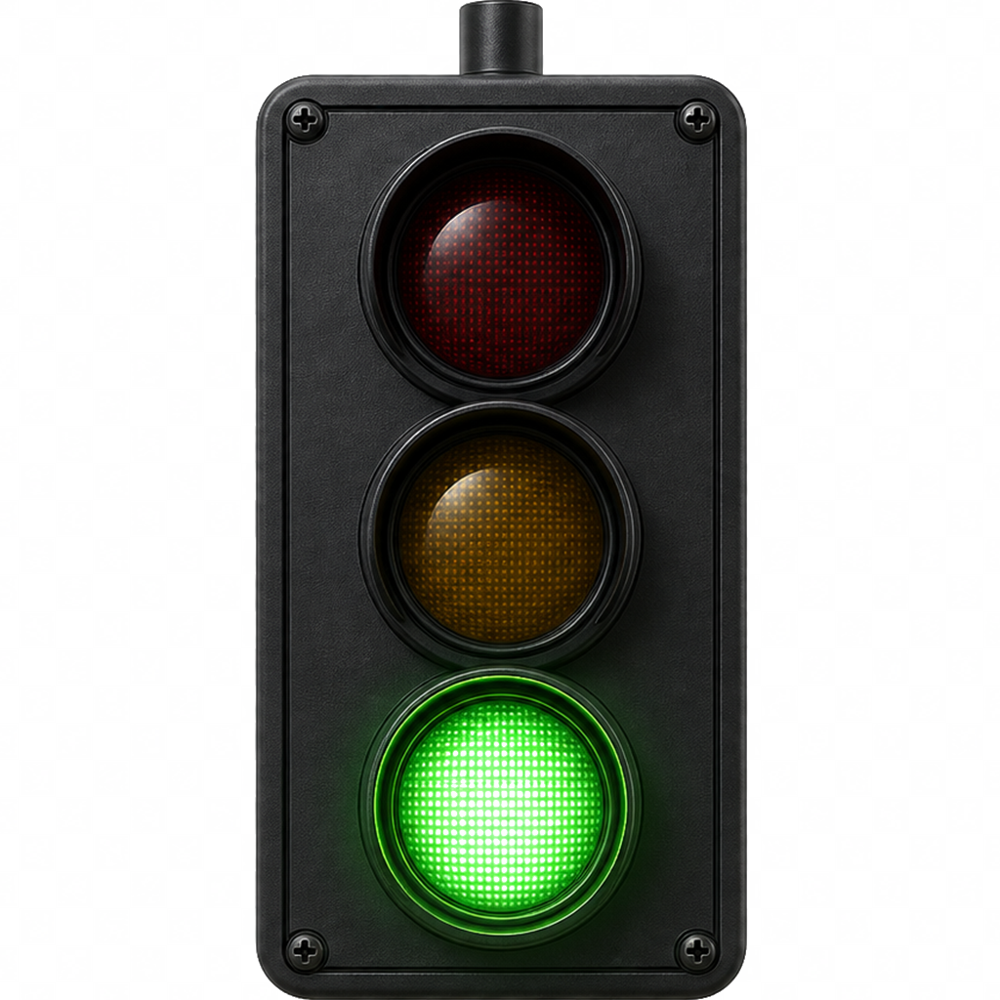

<div align="center">



# AgentLamp

**程序员的过街信号 / The Pedestrian Signal for Coders**

跨平台 AI Agent 状态灯 · 一盏物理交通信号灯告诉你 Claude Code / Cursor / Codex 现在在干什么

A cross-platform desktop status light for AI coding agents — pure software, zero hardware, MIT, free forever.

[](https://github.com/TarelX/AgentLamp/actions/workflows/build.yml)
[](LICENSE)

[简体中文](#简体中文) · [English](#english)

</div>

---

## 简体中文

### 它是什么

AI agent 跑长任务时，你不知道它在想 / 跑工具 / 等你授权 / 还是已经卡住。AgentLamp 把状态收敛成桌面上一盏小红绿灯，让你不用 alt-tab 几十次回去看终端。

- **绿灯常亮** → 空闲 / 最近任务正常结束
- **黄灯慢闪** → 正在跑（思考 / 调工具 / 改文件）
- **黄灯快闪** → **等你授权**（响 W1 三声 800Hz）
- **红灯常亮** → 任务失败
- **红灯快闪** → API 异常（限流 / token 失效 / 模型过载）
- **灰灯** → agent 已禁用或暂时无信号

聚合优先级：`红 > 黄(等待) > 黄(运行) > 绿 > 灰`。

### 当前支持

| Agent | v0.1 | 状态 |
|---|:---:|---|
| Claude Code | ✓ | 实测通过, 用 `~/.claude/settings.json` 官方 hooks |
| Cursor | ✓ | 实测通过, 用 `~/.cursor/hooks.json` |
| Codex | ✓ | 实测通过, 监听 `~/.codex/state_5.sqlite` |
| Cline / Aider / Continue / Windsurf | – | v0.3 计划 |

| Platform | v0.1 |
|---|:---:|
| Windows 10/11 | ✓ 主力实测 |
| macOS 12+ | – CI 编译通过, 未实测 |
| Linux | – CI 编译通过, 未实测 |

### 快速开始

#### 1. 下载

从 [Releases](https://github.com/TarelX/AgentLamp/releases) 下载对应平台的包：
- Windows → `AgentLamp-windows-amd64.zip`
- macOS → `AgentLamp-macos-arm64.zip`
- Linux → `AgentLamp-linux-amd64.zip`

#### 2. 启动

解压双击 `AgentLamp.exe`（Windows）/ `AgentLamp.app`（mac）/ `AgentLamp`（Linux）。

启动后会出现主窗口（420×720）+ 系统托盘图标（颜色随主灯）。

#### 3. 一键安装 hook

主窗口顶部点 **⚙ 设置** → **Hook 安装** → 对应 agent 点"一键安装"：

- **Claude Code**: 写入 `~/.claude/settings.json` 的 `hooks` 字段（自动备份原文件到 `.agentlamp.bak`）
- **Cursor**: 写入 `~/.cursor/hooks.json`（同样备份）

**完全关闭 Cursor / Claude Code 重新打开后**, hook 才会被加载（IDE 启动时读 hook 配置）。

#### 4. 跑任务看灯

随便发一条 prompt，灯会跟着 agent 状态变化。需要授权时灯快闪 + 响 W1。

### 工作原理

```
Cursor / Claude Code IDE
        │ 触发 hook (sessionStart / preToolUse / Notification / stop ...)
        ▼
%APPDATA%\AgentLamp\hook-relay.{ps1,sh}
        │ POST hook payload (curl + Invoke-RestMethod)
        ▼
http://127.0.0.1:19840/hook/<agent>/<event>
        │
        ▼
backend webhook server → adapter (event → state) → aggregator (优先级)
        │
        ▼
 Wails Event "status:update" → 前端 React → 物理灯组件 + Web Audio
```

Codex 不走 hook，每秒轮询 `~/.codex/state_5.sqlite` 的 `threads.updated_at_ms`，3 秒内有写入视为 running。

### 架构 / 技术栈

- **框架**: [Wails v3 alpha](https://v3.wails.io/)（Go + WebView）
- **前端**: React 18 + TypeScript + Vite + Zustand
- **后端**: Go 1.25 标准库 + `modernc.org/sqlite`（纯 Go，无 cgo）
- **音效**: Web Audio API 实时合成，零音频文件
- **CI**: GitHub Actions 三平台 native build

包大小: ~15 MB · 内存占用: ~80 MB · 无独立网络访问，全部本地。

### 与硬件版 / 其他软件版的差异

|  | [JasonLam08/cursor_agent_status_light](https://github.com/JasonLam08/cursor_agent_status_light) | [cxyax/AgentStatusLight](https://github.com/cxyax/AgentStatusLight) | **AgentLamp** |
|---|---|---|---|
| 形态 | ESP32 + LED | macOS 菜单栏 | 桌面悬浮物理灯 |
| 平台 | 跨平台（要硬件）| macOS only | **Win / Mac / Linux** |
| Agent 数 | 1 (Cursor) | 2 (Claude / Codex) | **3** (+ v0.3 计划 4) |
| 状态采集 | 自定义 hook | 文件解析 + 轮询 | **官方 hook + 文件解析双通道** |
| 音效 | – | mp3 文件 | **Web Audio 实时合成** |
| 视觉 | 真实 LED | 二维菜单图标 | 物理灯仿真 (CSS 3D) |

### 自己 build

```bash
# 装 Go 1.25 + Node 22
go install github.com/wailsapp/wails/v3/cmd/wails3@v3.0.0-alpha.96

# 检查环境
wails3 doctor

# 开发模式 (热重载)
wails3 dev

# 构建发行版
wails3 build         # 输出 bin/AgentLamp{.exe|.app|}
```

Linux 还需要：
```bash
sudo apt install pkg-config build-essential libgtk-4-dev libwebkit2gtk-4.1-dev libsoup-3.0-dev
```

### 致谢

- [JasonLam08/cursor_agent_status_light](https://github.com/JasonLam08/cursor_agent_status_light) — ESP32 硬件版启发，物理交通灯审美来源
- [cxyax/AgentStatusLight](https://github.com/cxyax/AgentStatusLight) — macOS 软件版先行者，状态语义参考
- [Wails](https://v3.wails.io/) — 让 Go + Web 跨平台桌面应用成为现实

### Roadmap

- **v0.1** ✓ 主框架 + Claude / Cursor / Codex 三 agent + 一键 hook + 悬浮窗 + systray
- **v0.2** Cline / Aider 适配 · WindowMask 修复 · 主题 · 工作时长统计
- **v0.3** Continue / Windsurf · 远程批准 · 团队 dashboard
- **v1.0** Show HN · r/ClaudeAI · r/cursor · V2EX 全渠道发布

---

## English

### What it does

When AI agents run long tasks, you can't tell at a glance whether they're thinking, calling a tool, waiting for your approval, or stuck on an error. AgentLamp condenses this into a single physical-looking traffic light on your desktop, so you stop alt-tabbing back to the terminal every minute.

- **Solid green** → idle / last task finished cleanly
- **Slow blinking yellow** → running (thinking / tool call / file edit)
- **Fast blinking yellow** → **waiting for you** (plays W1 — three short 800 Hz beeps)
- **Solid red** → task failed
- **Fast blinking red** → API failure (rate-limit / token / overload)
- **Gray** → agent disabled or no signal

Aggregation priority: `red > yellow(waiting) > yellow(running) > green > gray`.

### Quickstart

1. Download from [Releases](https://github.com/TarelX/AgentLamp/releases) for your platform.
2. Launch the app. A main window appears + a tray icon (color follows main lamp).
3. Open ⚙ **Settings → Hook Install** → click **Install** for Claude / Cursor. Restart your IDE to load the hook.
4. Run any task in Cursor / Claude Code. The lamp follows your agent's state in real time.

### Stack

Wails v3 (alpha) · Go 1.25 · React 18 · Web Audio · `modernc.org/sqlite` (pure Go) · GitHub Actions multi-platform CI.

### License

MIT — see [LICENSE](LICENSE). Free forever, no paid tier.

---

<sub>v0.1.x is alpha. Expect rough edges. File issues / PRs welcome.</sub>
